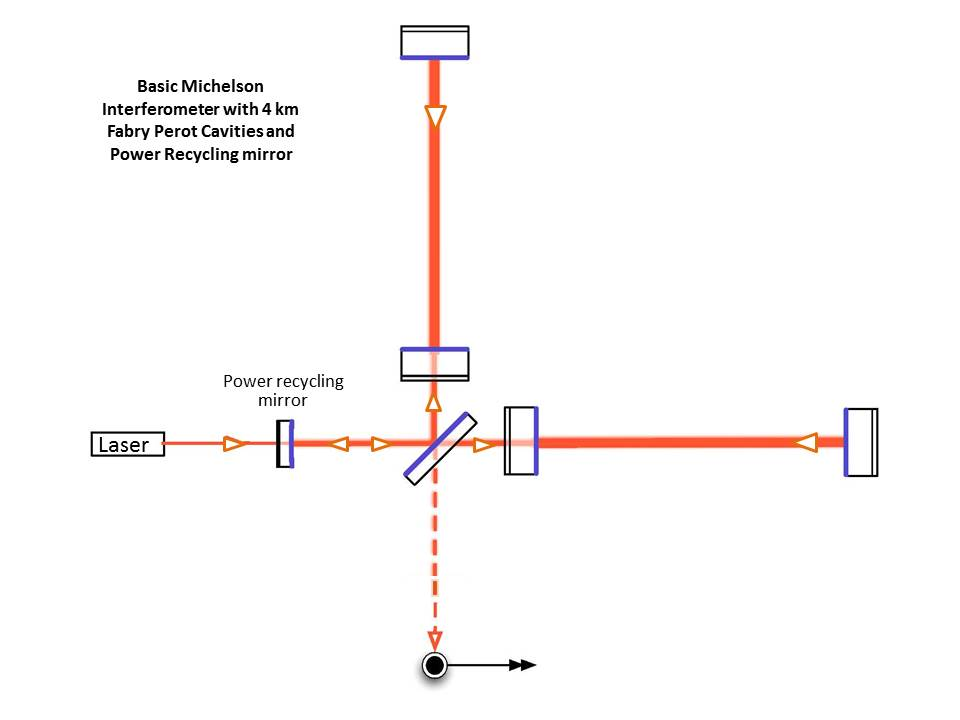
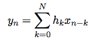
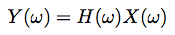
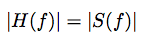
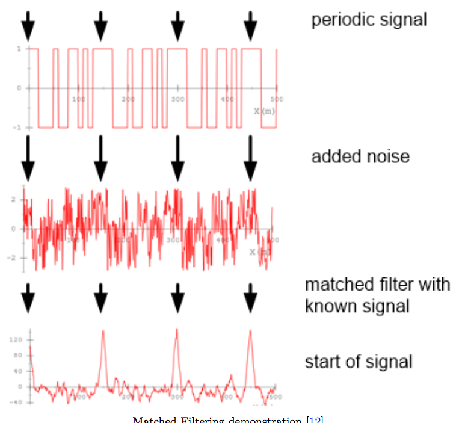

% Gravitational Waves Data Analysis
% Shahnawaz Ahmed
% 25 November 2016

LIGO
--------------------

* The Laser Interferometer Gravitational-Wave Observatory

* Two observatories - Hanford and Livingston

* Michelson interferometers of arm length around 4 km

* Fabry Perot addition to increase the effective arm length

* Detects strain in mirror position by interferometry

Michelson Interferometer 
------------------------

Fabry Perot addition
------------------------

Principle
---------

* Speed of light is constant 

* Difference in path lengths leds to interference

* Different from the antena principle, hence no relation to lengths

* Longer path gives better strain precision

Data
---------

* Time series data of strain

 

Noise
-----------
* More than 99 % data is noise 

* Seismic Noise

* Thermal Noise

* Photon shot noise

* Muon Shower noise

Spectral density
----------------------
* Fourier transform of signal. (ASD)

 

Noise removal
-------------
* Whitening 

* Notch filtering

Linear time invariant systems
-----------------------------

* Relationship between input signal and output

* Characterized by impulse response of system

Convolution
-----------
* Output given by convolution of input with impulse response

* Convolution theorem : Convolution is product in frequency domain

Filters
-------
* Filters are nothing but LTI systems with specific impulse response

Low pass filter
---------------

* Ideal transfer function in frequency domain is rect(x)

Low pass filter
---------------

* Filter transfer function with Bandwith B is : 

Matched filter
--------------
* Signal corrupted by linear noise

* Maximize the SNR

Matched filter
--------------
* Transfer function is same as the know signal 

Matched filter
--------------
* Output is the desired signal

Data Analysis
-------------

* ASD of data

Data Analysis
-------------

* Whitened data

Data Analysis
-------------

* Matched waveform

