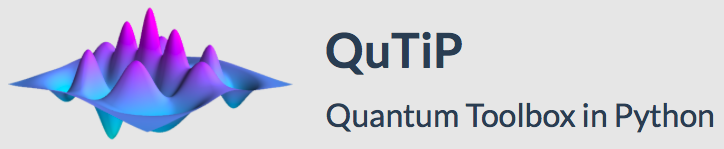
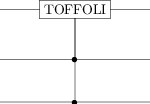
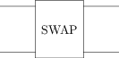
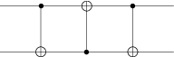

% QuTiP
% Shahnawaz Ahmed
% December 2016
--------------------



-----------------------------
* Python library for simulating open quantum systems 
* It can be used for quantum circuit simulations
* Uses Cython to compile and run C/C++ code.
---------------

```python
# Importing necessary modules
from qutip import *
import matplotlib.pyplot as plt
import numpy as np
from IPython.display import Image
# Magic command to plot images inline
%matplotlib inline
```
----------------------
# Quantum object class: qobj

* ```Qobj``` is the class used for representing any quantum object such as states and operators 
* Contains all the information required to describe a quantum system, such as its matrix representation, composite structure and dimensionality
* Define qubits in computational basis (|0>, |1>) and combine them to form |+> and |->


```python
q0 = Qobj([[1], [0]])
q0
```


Quantum object: dims = [[2], [1]], shape = [2, 1], type = ket\begin{equation*}\left(\begin{array}{*{11}c}1.0\\0.0\\\end{array}\right)\end{equation*}


```python
q1 = Qobj([[0], [1]])
q1
```


Quantum object: dims = [[2], [1]], shape = [2, 1], type = ket\begin{equation*}\left(\begin{array}{*{11}c}0.0\\1.0\\\end{array}\right)\end{equation*}


```python
h0 = (q0 + q1)/np.sqrt(2)
h0
```


Quantum object: dims = [[2], [1]], shape = [2, 1], type = ket\begin{equation*}\left(\begin{array}{*{11}c}0.707\\0.707\\\end{array}\right)\end{equation*}


```python
h1 = (q0 - q1)/np.sqrt(2)
h1
```


Quantum object: dims = [[2], [1]], shape = [2, 1], type = ket\begin{equation*}\left(\begin{array}{*{11}c}0.707\\-0.707\\\end{array}\right)\end{equation*}

------------------------------------------------------

The Pauli X gate and the Hadamard gate H is already defined


```python
X = sigmax()
X
```


Quantum object: dims = [[2], [2]], shape = [2, 2], type = oper, isherm = True\begin{equation*}\left(\begin{array}{*{11}c}0.0 & 1.0\\1.0 & 0.0\\\end{array}\right)\end{equation*}


```python
H = hadamard_transform(N=1)
H
```


Quantum object: dims = [[2], [2]], shape = [2, 2], type = oper, isherm = True\begin{equation*}\left(\begin{array}{*{11}c}0.707 & 0.707\\0.707 & -0.707\\\end{array}\right)\end{equation*}


---------------------------
* Apply the gates X to q0 and q1
* Apply the Hadamard gate to q0 to get the |+> state


```python
X*q0
```


Quantum object: dims = [[2], [1]], shape = [2, 1], type = ket\begin{equation*}\left(\begin{array}{*{11}c}0.0\\1.0\\\end{array}\right)\end{equation*}


```python
X*q1
```


Quantum object: dims = [[2], [1]], shape = [2, 1], type = ket\begin{equation*}\left(\begin{array}{*{11}c}1.0\\0.0\\\end{array}\right)\end{equation*}


```python
H*q0
```


Quantum object: dims = [[2], [1]], shape = [2, 1], type = ket\begin{equation*}\left(\begin{array}{*{11}c}0.707\\0.707\\\end{array}\right)\end{equation*}


```python
H*q1
```


Quantum object: dims = [[2], [1]], shape = [2, 1], type = ket\begin{equation*}\left(\begin{array}{*{11}c}0.707\\-0.707\\\end{array}\right)\end{equation*}


-----------------
* You can compare two states easily or check properties of the ```Qobj```


```python
print(h0 == H*q0)
print(h1 == H*q1)
```

    True
    True

-----------
# Tensor products of ```Qobj```
* You can also write tensor products easily with the ```tensor()``` function.
* Define a maximally entangled Bell state


```python
bell0 = tensor(q0, q0)
bell0
```


Quantum object: dims = [[2, 2], [1, 1]], shape = [4, 1], type = ket\begin{equation*}\left(\begin{array}{*{11}c}1.0\\0.0\\0.0\\0.0\\\end{array}\right)\end{equation*}


-------
* Define a tensor product of two operators H, X and apply it to the bell state


```python
HX = tensor(H, X)
HX*bell0
```


Quantum object: dims = [[2, 2], [1, 1]], shape = [4, 1], type = ket\begin{equation*}\left(\begin{array}{*{11}c}0.0\\0.707\\0.0\\0.707\\\end{array}\right)\end{equation*}


-----------------------
# Quantum circuits

* Gates and representation

## CNOT


```python
CNOT = cnot()
CNOT
```


Quantum object: dims = [[2, 2], [2, 2]], shape = [4, 4], type = oper, isherm = True\begin{equation*}\left(\begin{array}{*{11}c}1.0 & 0.0 & 0.0 & 0.0\\0.0 & 1.0 & 0.0 & 0.0\\0.0 & 0.0 & 0.0 & 1.0\\0.0 & 0.0 & 1.0 & 0.0\\\end{array}\right)\end{equation*}


# TOFFOLI


```python
toffoli()
```


Quantum object: dims = [[2, 2, 2], [2, 2, 2]], shape = [8, 8], type = oper, isherm = True\begin{equation*}\left(\begin{array}{*{11}c}1.0 & 0.0 & 0.0 & 0.0 & 0.0 & 0.0 & 0.0 & 0.0\\0.0 & 1.0 & 0.0 & 0.0 & 0.0 & 0.0 & 0.0 & 0.0\\0.0 & 0.0 & 1.0 & 0.0 & 0.0 & 0.0 & 0.0 & 0.0\\0.0 & 0.0 & 0.0 & 1.0 & 0.0 & 0.0 & 0.0 & 0.0\\0.0 & 0.0 & 0.0 & 0.0 & 1.0 & 0.0 & 0.0 & 0.0\\0.0 & 0.0 & 0.0 & 0.0 & 0.0 & 1.0 & 0.0 & 0.0\\0.0 & 0.0 & 0.0 & 0.0 & 0.0 & 0.0 & 0.0 & 1.0\\0.0 & 0.0 & 0.0 & 0.0 & 0.0 & 0.0 & 1.0 & 0.0\\\end{array}\right)\end{equation*}


```python
Image(filename='toffoli.png')
```





## Defining a quantum circuit


```python
q = QubitCircuit(3, reverse_states=False)
q.add_gate("TOFFOLI", controls=[0, 2], targets=[1])
Image("toffoli.png")
```


```python
N = 2
qc0 = QubitCircuit(N)
qc0.add_gate("SWAP", [0, 1], None)
Image("swap.png")
```





Convert the gate 


```python
qc2 = qc0.resolve_gates("CNOT")
Image("qc2.png")
```





```python
U_list0 = qc0.propagators()
U0 = gate_sequence_product(U_list0)
U0
```


Quantum object: dims = [[2, 2], [2, 2]], shape = [4, 4], type = oper, isherm = True\begin{equation*}\left(\begin{array}{*{11}c}1.0 & 0.0 & 0.0 & 0.0\\0.0 & 0.0 & 1.0 & 0.0\\0.0 & 1.0 & 0.0 & 0.0\\0.0 & 0.0 & 0.0 & 1.0\\\end{array}\right)\end{equation*}


```python
qc1 = QubitCircuit(N)
qc1.add_gate("CNOT", 0, 1)
qc1.add_gate("CNOT", 1, 0)
qc1.add_gate("CNOT", 0, 1)
```
